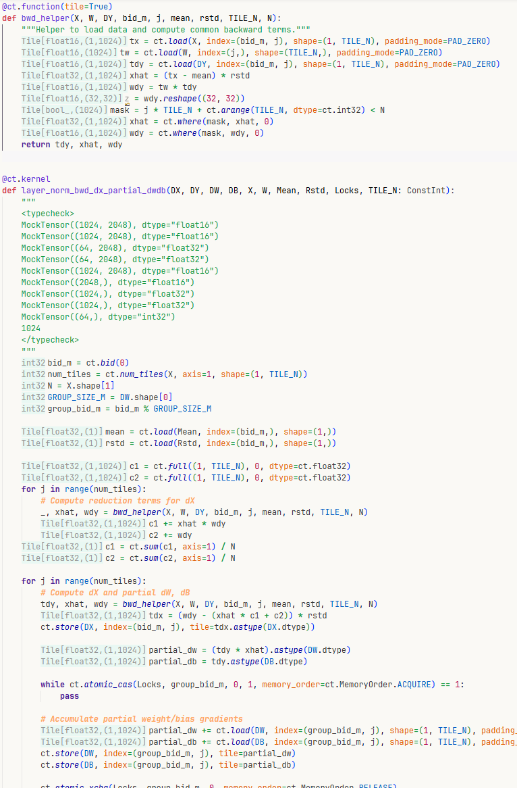

# cutile_typeviz: cuTile Type Hints

Provide inlay type hints for cuTile programs.



## Build

1. Install this repo as a package in your current python environment with `pip install -e .`
2. Build and install the extension

## Quick Build
```sh
bash build_ext.sh
```


## Usage

- Activate the extension
- Choose a python interpreter in `ms-python` extension. You should have this repo installed as a package in your environment
- Change the file extension to `.cutile.py`
- Add `<typecheck>` annotations in your kernel's docstring (see below)
    - Hint: You may feed the following rule and an example into LLM and have it write the type annotation for you.


## TODO

- Errors other than tile errors should cause the plugin to report error
- Hints and diagnostics for lines exceeding the original file's line count should not be displayed (if the end line exceeds the limit, only display up to the last character of the last line)


## Type Annotation Rules

To enable type checking and visualization for cuTile kernels, you need to annotate your kernel function's parameters using the `<typecheck>` tag in the docstring.

### Syntax

```python
@ct.kernel
def your_kernel(param1, param2, param3, const_param: ConstInt):
    """
    <typecheck>
    MockTensor((shape_tuple), dtype="dtype_string")
    MockTensor((shape_tuple), dtype="dtype_string")
    MockTensor((shape_tuple), dtype="dtype_string")
    scalar_value
    </typecheck>
    
    Your docstring description here...
    """
    # kernel implementation
```

### Rules

1. **Placement**: The `<typecheck>` block must be placed at the **beginning** of the docstring
2. **Order**: Each line corresponds to a function parameter **in the same order** as they appear in the function signature
3. **One per line**: Each parameter annotation must be on its own line

### Parameter Types

| Parameter Type | Annotation Format | Example |
|----------------|-------------------|---------|
| Tensor | `MockTensor((...shape), dtype="dtype")` | `MockTensor((1024, 2048), dtype="float16")` |
| Integer scalar | Numeric literal | `32`, `64`, `128` |
| Float scalar | Numeric literal | `1e-5`, `0.1` |

### Supported Data Types (dtype)

The following dtype strings are supported for `MockTensor`:

| Category | Supported Types |
|----------|-----------------|
| Boolean | `bool` |
| Unsigned Integer | `uint8`, `uint16`, `uint32`, `uint64` |
| Signed Integer | `int8`, `int16`, `int32`, `int64` |
| Floating Point | `float16`, `float32`, `float64`, `bfloat16`, `tfloat32` |
| FP8 | `float8_e4m3fn`, `float8_e5m2` |

### Example

```python
import cuda.tile as ct

ConstInt = ct.Constant[int]

@ct.kernel
def batch_matmul_kernel(A, B, C, tm: ConstInt, tn: ConstInt, tk: ConstInt):
    """
    <typecheck>
    MockTensor((16, 1024, 2048), dtype="bfloat16")
    MockTensor((16, 2048, 512), dtype="bfloat16")
    MockTensor((16, 1024, 512), dtype="bfloat16")
    32
    64
    128
    </typecheck>
    
    CuTile kernel for batch matrix multiplication.
    A has shape (Batch, M, K), B has shape (Batch, K, N), C has shape (Batch, M, N).
    """
    # kernel implementation...
```

For more examples, see the `examples/` directory.

